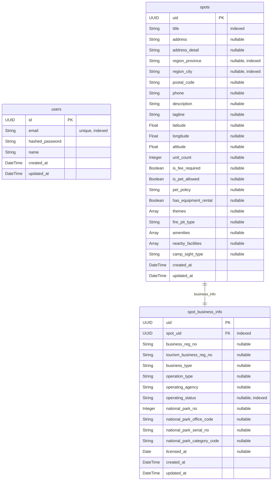

# ERD (Entity Relationship Diagram)

> SQLAlchemy 모델 기준으로 작성. 스키마 변경 시 이 파일을 함께 업데이트할 것.

## 테이블 설명

| 테이블 | 설명 |
|---|---|
| `users` | 회원 계정 (이메일/패스워드 인증) |
| `spots` | 국립공원 등 공공 raw 데이터 기반 스팟 |
| `spot_business_info` | spots의 사업자/인허가 정보 (1:1) |
