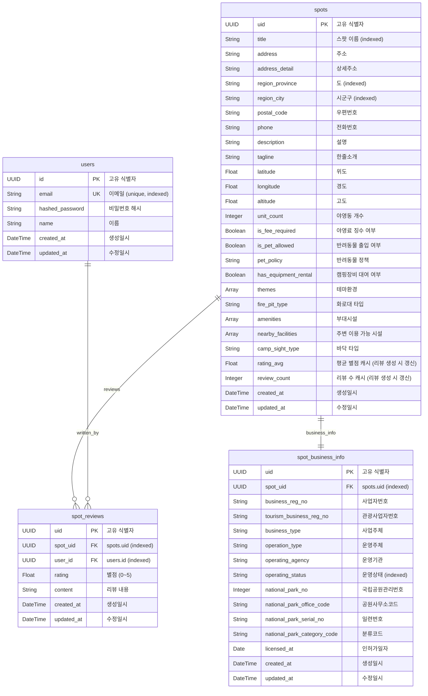

# ERD (Entity Relationship Diagram)

> SQLAlchemy 모델 기준으로 작성. 스키마 변경 시 이 파일을 함께 업데이트할 것.

---

## users

| 필드명 | 타입 | 설명 | 비고 |
|---|---|---|---|
| id | UUID | 고유 식별자 | PK |
| email | String | 이메일 | unique, indexed |
| hashed_password | String | 비밀번호 해시 | |
| name | String | 이름 | |
| created_at | DateTime | 생성일시 | |
| updated_at | DateTime | 수정일시 | |

## spots

| 필드명 | 타입 | 설명 | 비고 |
|---|---|---|---|
| uid | UUID | 고유 식별자 | PK |
| title | String | 스팟 이름 | indexed |
| address | String | 주소 | nullable |
| address_detail | String | 상세주소 | nullable |
| region_province | String | 도 | nullable, indexed |
| region_city | String | 시군구 | nullable, indexed |
| postal_code | String | 우편번호 | nullable |
| phone | String | 전화번호 | nullable |
| description | String | 설명 | nullable |
| tagline | String | 한줄소개 | nullable |
| latitude | Float | 위도 | nullable |
| longitude | Float | 경도 | nullable |
| altitude | Float | 고도 | nullable |
| unit_count | Integer | 야영동 개수 | nullable |
| is_fee_required | Boolean | 야영료 징수 여부 | nullable |
| is_pet_allowed | Boolean | 반려동물 출입 여부 | nullable |
| pet_policy | String | 반려동물 정책 | nullable |
| has_equipment_rental | Boolean | 캠핑장비 대여 여부 | nullable |
| themes | String[] | 테마환경 | nullable |
| fire_pit_type | String | 화로대 타입 | nullable |
| amenities | String[] | 부대시설 | nullable |
| nearby_facilities | String[] | 주변 이용 가능 시설 | nullable |
| camp_sight_type | String | 바닥 타입 (파쇄석/흙/잔디/데크 등) | nullable |
| rating_avg | Float | 평균 별점 캐시 | 리뷰 생성 시 자동 갱신 |
| review_count | Integer | 리뷰 수 캐시 | 리뷰 생성 시 자동 갱신 |
| created_at | DateTime | 생성일시 | |
| updated_at | DateTime | 수정일시 | |

## spot_business_info

| 필드명 | 타입 | 설명 | 비고 |
|---|---|---|---|
| uid | UUID | 고유 식별자 | PK |
| spot_uid | UUID | 연결된 spots.uid | FK, indexed |
| business_reg_no | String | 사업자번호 | nullable |
| tourism_business_reg_no | String | 관광사업자번호 | nullable |
| business_type | String | 사업주체 | nullable |
| operation_type | String | 운영주체 | nullable |
| operating_agency | String | 운영기관 | nullable |
| operating_status | String | 운영상태 | nullable, indexed |
| national_park_no | Integer | 국립공원관리번호 | nullable |
| national_park_office_code | String | 공원사무소코드 | nullable |
| national_park_serial_no | String | 일련번호 | nullable |
| national_park_category_code | String | 분류코드 | nullable |
| licensed_at | Date | 인허가일자 | nullable |
| created_at | DateTime | 생성일시 | |
| updated_at | DateTime | 수정일시 | |

## spot_reviews

| 필드명 | 타입 | 설명 | 비고 |
|---|---|---|---|
| uid | UUID | 고유 식별자 | PK |
| spot_uid | UUID | 연결된 spots.uid | FK, indexed |
| user_id | UUID | 작성자 users.id | FK, indexed |
| rating | Float | 별점 (0~5) | CHECK 0≤rating≤5 |
| content | String | 리뷰 내용 | nullable |
| created_at | DateTime | 생성일시 | |
| updated_at | DateTime | 수정일시 | |
